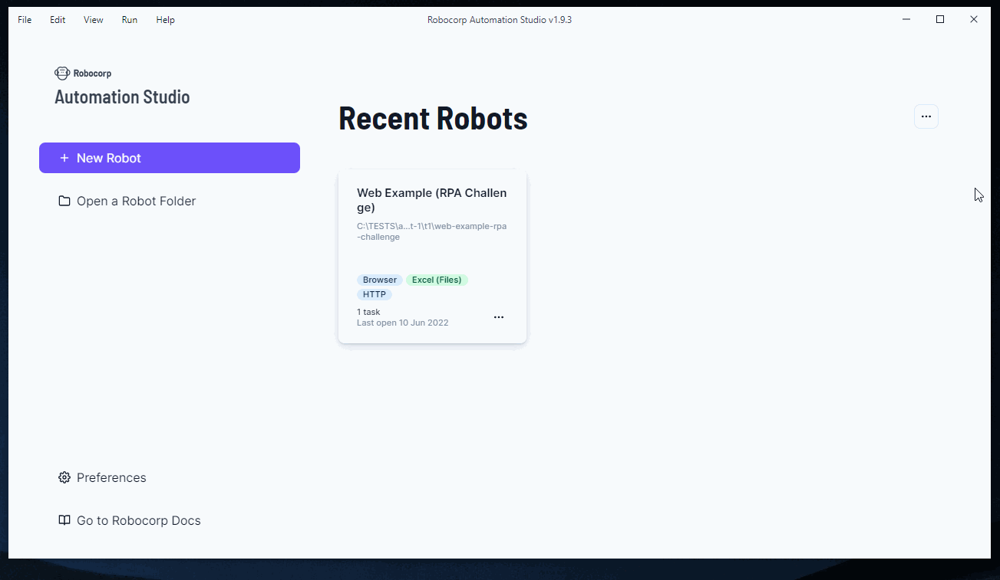
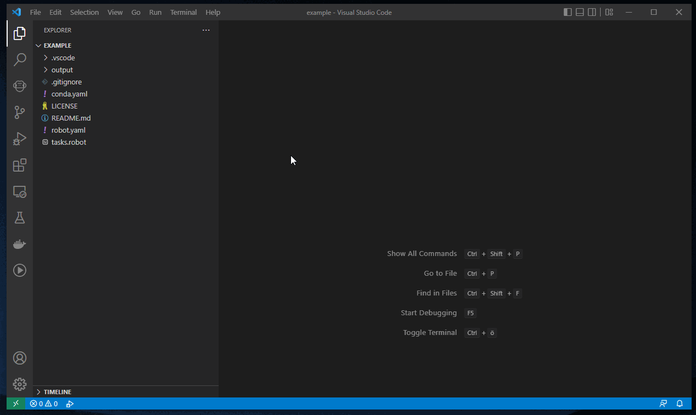
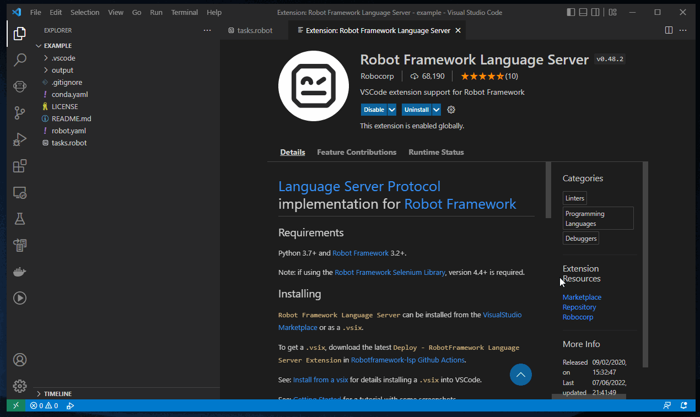
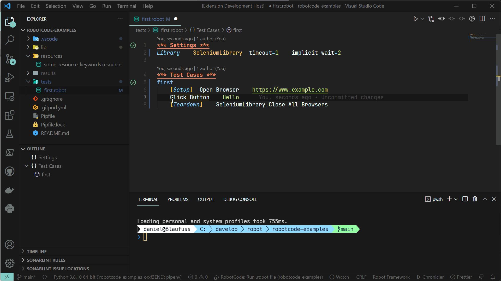

import Tabs from '@theme/Tabs';
import TabItem from '@theme/TabItem';

:rocket: **Welcome!** <br/>
You can find more explanations and guidance down below, but first, let's get you running a bot :runner:

## Run your first robot
The scripts below enable you to get a robot setup and running from a selection of templates using a CLI tool called [RCC](https://github.com/robocorp/rcc#readme)

<Tabs>
<TabItem value="Windows" label="Windows" default>

```
curl -o rcc.exe https://downloads.robocorp.com/rcc/releases/latest/windows64/rcc.exe
rcc create example
cd example
..\rcc run
```
</TabItem>
<TabItem value="MacOS" label="MacOS">

```
brew install robocorp/tools/rcc
rcc create example
cd example
../rcc run
```
</TabItem>
<TabItem value="Linux" label="Linux">

```
curl -o rcc https://downloads.robocorp.com/rcc/releases/latest/linux64/rcc
chmod a+x rcc
rcc create example
cd example
../rcc run
```
</TabItem>
</Tabs>

The first run sets up the environment, so it takes a bit longer, but if you do the `rcc run` a second time, you'll see the power of RCC.

:rocket: With your bot running, you can now look deeper into what you just did and then jump on to editors to get cracking.

## What is this RCC?

[RCC](https://github.com/robocorp/rcc#readme) is an open-source tool that handles everything essential around an RPA robot run on Windows, macOS, and Linux. With RCC, the machine running the robot does not even need Python installed.

So, if you look back into [the first robot you ran](/getting_started/rpa#run-your-first-robot), you will see the following:
1. The environment your bot needs is defined in: [conda.yaml](https://github.com/robocorp/rcc/blob/master/docs/recipes.md#what-is-in-condayaml)
1. How your robot is executed is defined in: [robot.yaml](https://github.com/robocorp/rcc/blob/master/docs/recipes.md#what-is-in-robotyaml)
1. The logic of your bot is in Robot Framework (`.robot`) or Python (`.py`) -files... or both.

With the above files [RCC](https://github.com/robocorp/rcc#readme) can set up an isolated environment and ensure your bot runs the same way every time.<br/>
:point_right: Get rid of: "Works on my machine".

> RCC has a lot of cool tricks, so once you've gotten started, it is worth [check out some more](https://github.com/robocorp/rcc/tree/master/docs#readme)

:rocket: So now you have your bot running and have a slight idea how you got there; what next?<br/> 
You need to see and edit your bot code to get it doing what you need, so head-on to the [Editor and IDEs](/getting_started/rpa#editors-and-ides)

## Editors and IDEs
There is no shortage of editors for Robot Framework and Python, but for RPA work, we limit the list to get you started. In the end, what you create is just Robot Framework and Python code, so you are not limited to the tools mentioned here.

### Automation Studio
If you are unfamiliar with coding and tools like VS Code, we'd recommend starting with a tool like [Automation Studio](https://robocorp.com/automation-studio).



This kind of IDE enables you to start without worrying about syntax, environments, etc., right from the bat. You can still get quite far, and the tool allows you to see and edit on the code level. Automation Studio is also creating a robot just like the first RCC bot, so you can jump to other tools if you feel limited.

> For the test automation people:<br/>
Note that there is very little RPA specific about Automation Studio as it is just generating Robot Framework code.<br/>
Even hard-boiled coders like to do things easy once in a while :wink:

### Visual Studio Code

If you are using [VS Code](https://code.visualstudio.com) or are looking for the complete feature set of developer tools, then the extensions are for you.

:point_right: [Get VS Code here](https://code.visualstudio.com)

To get going with RPA development, you need two extensions: The extension for LSP and the RCC extension.

### RCC extension for VS Code
This extension brings in the RCC functionality with command palette commands and a nice sidebar.

:point_right: [Get Robocorp Code here](https://marketplace.visualstudio.com/items?itemName=robocorp.robocorp-code)



### Robot Framework LSP extensions for VS Code
Language Server Protocol extensions bring in code completion, documentation, highlighting, etc., for your Robot Framework code.
There are options here, but **remember only to install one** as multiple LSP handlers will cause problems:


<Tabs>
<TabItem value="LSP" label="Robot Framework Language Server" default>

:point_right: [Get Robot Framework LSP here](https://marketplace.visualstudio.com/items?itemName=robocorp.robotframework-lsp)



</TabItem>
<TabItem value="RobotCode" label="Robot Code">

:point_right: [Get Robot Code here](https://marketplace.visualstudio.com/items?itemName=d-biehl.robotcode)


</TabItem>
</Tabs>


## About Robotic Process Automation (RPA)

Robotic Process Automation (RPA) is similar to test automation on the technical level, but the mentality is different on the business and results side. In RPA, it is pretty standard that you are not running on a machine you control entirely, so your robot needs to be "self-sufficient" and isolated. Also, instead of finding and documenting places where robot execution fails or succeeds, the aim is always to succeed and get the result of the process. 

Isolation and repeatability are the other vital points in RPA. The bot needs to execute with minimal setup by IT people, and where governance is a thing, locking down your dependencies is a must-have feature.
With RCC environment caching and wrapping features, you can lock down your dependencies to the actual unique files. In RPA, you do not want loose dependency handling breaking your production bots. 

> Remember `pip install numpy` does **not** mean you will get the latest version;<br/>
it means you are OK with getting whatever version you get :wink:

All this validates a separate getting started brief and a difference in tooling. The actual logic of calling out APIs and interacting with browsers and applications is still the same as in test automation. 

:rocket: So by this point, you should have run your first bot, have an editor / IDE up-n-and running, and have an idea of the slight differences between RPA and test automation using Robot Framework.
You are raring to go, so go ahead and check out the resources and libraries -part.

## RPA resources to get started

For the resources and libraries part you can check out the following pages:
* [RPA libraries](/different_libraries/rpa)
* [How to find the right library](/different_libraries/how_to_find_library)
* Sources for RPA example in Robot Framework:
  * [Robocorp Portal](https://robocorp.com/portal/) 

The main point to remember is that with Robot Framework and Python, there are just about no limits to what you can do. There are a ton of libraries out there, but you can also make your own.

We always recommend giving back to the open-source community, as you usually get more back than you put in. 

For example:
It is quite rare that the business value of an RPA process is in the library that interacts with an application or an API, so why not publish the connectivity part as open-source and get others to chip in on the maintenance and improvements? This way, you can focus more on the actual RPA problem.
* [Releasing your own library](/extending_robot_framework/releasing_your_own_libraries)
* [Helpout with this documentation](/contribute)
* Create example bots into the public repository and ping in the forums and Slacks


